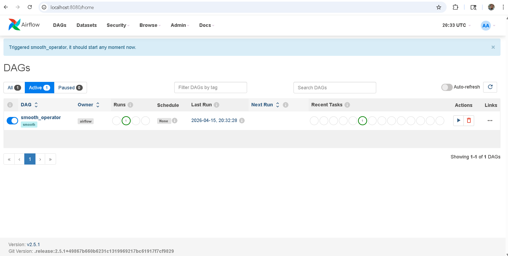
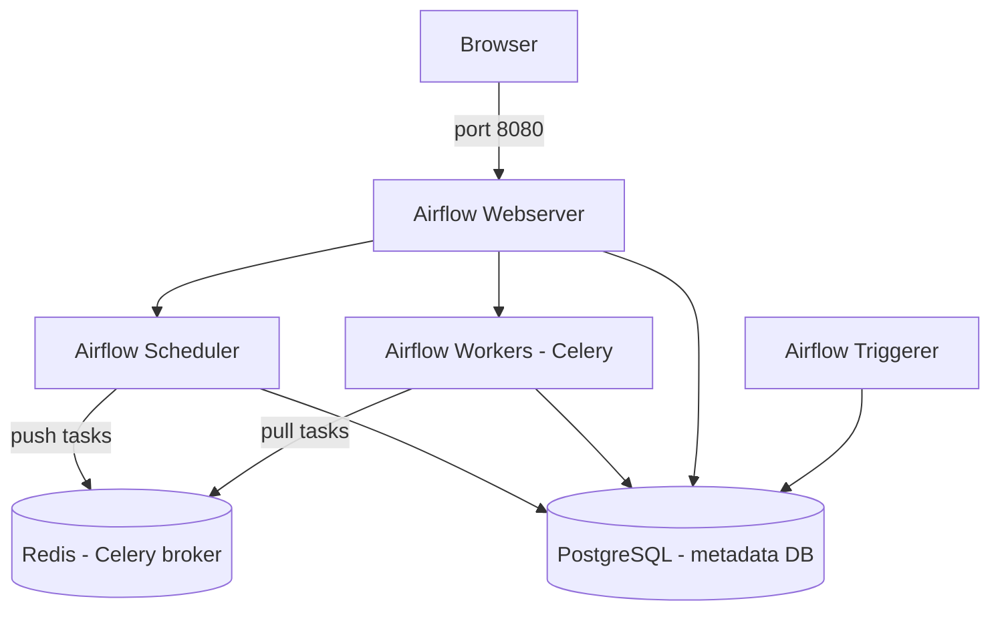

# dre-3-test — Airflow SRE Technical Assessment

## Overview

This repo contains a broken Apache Airflow setup using Docker Compose. The task was to identify all failures, fix them, get the stack running, and document how it would be deployed at scale in a cloud environment.

---

## Bugs Found and Fixed

### Bug 1 — Postgres credential mismatch (critical)

**File**: `compose.yaml`

**Problem**: The Postgres service was configured with `POSTGRES_USER: admin`, but the Airflow metadata database connection string (`SQL_ALCHEMY_CONN`) was hardcoded to connect as `airflow:airflow@postgres`. These credentials don't match, so Airflow can't authenticate to the database at startup. All services that depend on the metadata DB — scheduler, webserver, workers — fail immediately.

**Fix**: Changed `POSTGRES_USER` from `admin` to `airflow` to align with the connection string.

```yaml
# Before
POSTGRES_USER: admin

# After
POSTGRES_USER: airflow
```

---

### Bug 2 — Webserver healthcheck pointing to invalid port (critical)

**File**: `compose.yaml`

**Problem**: The `airflow-webserver` healthcheck was set to `http://localhost:xxxx/health` — the literal string `xxxx`, not a port number. Docker cannot resolve this URL, so the webserver is always reported as unhealthy and all services depending on it never start.

**Fix**: Replaced `xxxx` with `8080`, the actual port the webserver binds to.

```yaml
# Before
test: ["CMD", "curl", "--fail", "http://localhost:xxxx/health"]

# After
test: ["CMD", "curl", "--fail", "http://localhost:8080/health"]
```

---

### Bug 3 — Volume mount path typo (critical)

**File**: `compose.yaml`

**Problem**: The DAGs volume was mounted from `./dag` (singular), but the actual directory in the repository is `dags` (plural). Airflow mounts an empty path, so no DAGs are loaded and the scheduler has nothing to run.

**Fix**: Changed volume mount from `./dag` to `./dags`.

```yaml
# Before
- ./dag:/opt/airflow/dags

# After
- ./dags:/opt/airflow/dags
```

---

### Bug 4 — Python syntax error in DAG (critical)

**File**: `dags/smooth.py`

**Problem**: The DAG function definition is missing a colon — `def smooth()` instead of `def smooth():`. Python raises a `SyntaxError` when Airflow attempts to parse this file, so the DAG never appears in the scheduler or UI.

**Fix**: Added the missing colon.

```python
# Before
def smooth()

# After
def smooth():
```

---

### Bug 5 — Non-existent operator import (critical)

**File**: `dags/smooth.py`

**Problem**: The DAG imports `SmoothOperator` from `airflow.operators.smooth`. This module does not exist in any version of Apache Airflow. The import raises an `ImportError` and the DAG fails to load entirely.

**Fix**: Implemented `SmoothOperator` as a custom operator in `plugins/smooth_operator.py`. Airflow automatically loads all classes placed in the `/opt/airflow/plugins/` directory, so the import works without any additional configuration.

```python
# Before
from airflow.operators.smooth import SmoothOperator

# After
from smooth_operator import SmoothOperator  # resolved from /opt/airflow/plugins/
```

---

## How to Run

### Requirements

- Docker Engine 20.10+
- Docker Compose v2+

### Start the stack

```bash
git clone https://github.com/cauimchagas/dre-3-test
cd dre-3-test
echo -e "AIRFLOW_UID=$(id -u)" > .env
docker compose up --build
```

Wait approximately 60–90 seconds for all services to initialise.

### Access the UI

Open your browser at `http://localhost:8080`

Default credentials:
- Username: `airflow`
- Password: `airflow`

### Airflow UI Running



### Trigger the DAG

Once the UI loads, locate the `smooth` DAG and toggle it on. You can also trigger it from the CLI:

```bash
docker exec -it dre-3-test-airflow-webserver-1 bash
airflow dags trigger smooth
```

### Verify services are healthy

```bash
docker compose ps
docker compose logs scheduler
docker compose logs airflow-webserver
```

### Stop

```bash
docker compose down
```

To also remove volumes:

```bash
docker compose down -v
```

---

## Architecture

### Local (Docker Compose)



### Cloud (AWS — production scale)

See `bonus-architecture.md` for the full production deployment design on AWS EKS.

| Local component | AWS equivalent |
|---|---|
| Airflow services (all) | Amazon EKS (Kubernetes) |
| PostgreSQL container | Amazon RDS PostgreSQL — Multi-AZ |
| Redis container | Amazon ElastiCache (Redis) |
| `./logs` volume | Amazon S3 + CloudWatch Logs |
| Environment variables | AWS Secrets Manager |
| Manual `docker compose up` | GitHub Actions CI/CD pipeline |

---

## Project Structure

```
dre-3-test/
├── compose.yaml               # Fixed Docker Compose (3 bugs corrected)
├── dags/
│   └── smooth.py              # Fixed DAG (2 bugs corrected)
├── plugins/
│   └── smooth_operator.py     # Custom SmoothOperator implementation
├── logs/                      # Airflow logs (auto-created)
├── screenshots/
│   └── airflow-ui.png         # Airflow UI running screenshot
├── bonus-architecture.md      # Full cloud deployment design document
└── README.md                  # This file
```
