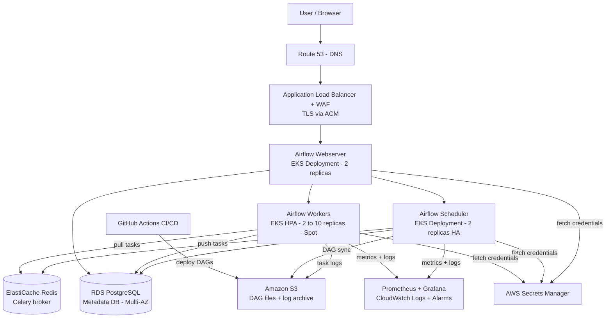

# Bonus Architecture — Airflow on AWS at Production Scale

This document covers how to deploy the same Airflow setup into a production AWS environment: resilient, secure, observable, and cost-efficient.

---

## High-Level Architecture



---

## Component Decisions

### Compute — Amazon EKS

All Airflow components run as Kubernetes workloads on EKS. The CeleryExecutor is retained for autoscaling workers independently of the scheduler.

- Webserver and Scheduler run as `Deployment` objects with `replicas: 2` for HA.
- Workers run with a `HorizontalPodAutoscaler` targeting CPU utilisation at 70%, scaling between 2 and 10 replicas.
- Node groups use `m5.xlarge` on-demand instances for scheduler/webserver (stable latency) and `m5.large` Spot instances for workers (cost savings on batch work).
- Cluster Autoscaler is enabled to add/remove EC2 nodes based on pending pod pressure.

### Helm Deployment

Airflow is deployed using the official [Apache Airflow Helm chart](https://airflow.apache.org/docs/helm-chart/stable/index.html). This handles init containers for DB migrations, persistent volume claims for logs, ConfigMaps for `airflow.cfg` overrides, and ServiceAccounts with IRSA for S3 and Secrets Manager access.

```bash
helm repo add apache-airflow https://airflow.apache.org
helm upgrade --install airflow apache-airflow/airflow \
  --namespace airflow \
  --values values-production.yaml
```

### Metadata Database — Amazon RDS PostgreSQL (Multi-AZ)

- Engine: PostgreSQL 14
- Instance: `db.t3.medium` (scale to `db.r5.large` if scheduler lag increases)
- Multi-AZ enabled — automatic failover in case of AZ failure
- Automated backups with 7-day retention
- Credentials stored in AWS Secrets Manager, injected into pods via the Secrets Store CSI Driver
- No public access — only reachable from within the VPC via the EKS security group

### Message Broker — Amazon ElastiCache (Redis)

- Engine: Redis 7.x
- Cluster mode disabled (single primary, one read replica)
- No persistence required — the broker holds transient task state only
- Placed in a private subnet, accessible only from worker pods

### DAG Deployment — GitOps via CI/CD

DAGs are version-controlled in Git. A GitHub Actions workflow handles deployment automatically on every merge to `main`:

1. Run linting (ruff, pylint)
2. Run DAG integrity checks (`airflow dags list-import-errors`)
3. Upload DAGs to S3 (`s3://company-airflow-dags/dags/`)
4. Sync into the cluster via git-sync sidecar (pulls from Git every 60s — no Docker image rebuild needed for DAG changes)

### Secrets Management — AWS Secrets Manager

No credentials are stored in environment variables or ConfigMaps. All secrets are stored in AWS Secrets Manager (Fernet key, DB password, Redis auth token) and injected at pod startup via the Secrets Store CSI Driver. Pods access secrets using IAM Roles for Service Accounts (IRSA) — no long-lived credentials anywhere.

```yaml
# IRSA annotation on Airflow ServiceAccount
annotations:
  eks.amazonaws.com/role-arn: arn:aws:iam::123456789:role/airflow-secrets-role
```

### Logging — CloudWatch + S3

- Task logs are written to `/opt/airflow/logs/` and streamed to CloudWatch Logs via a Fluent Bit DaemonSet.
- Logs older than 30 days are exported to S3, with Lifecycle rules moving them to Glacier after 90 days.
- Airflow's `remote_logging` is enabled, pointing at `s3://company-airflow-logs/`.

### Monitoring — Prometheus + Grafana + CloudWatch Alarms

- Airflow exposes a StatsD endpoint; `statsd-exporter` converts metrics to Prometheus format.
- Prometheus scrapes Airflow metrics every 15 seconds.
- Grafana dashboards cover DAG run success/failure rates, task queue depth, scheduler heartbeat lag, worker pod count, and DB connection pool saturation.
- CloudWatch Alarms fire on: scheduler heartbeat missing for more than 5 minutes, worker pod count hitting 0, RDS storage below 20%, and ElastiCache memory above 80%.
- PagerDuty integration via CloudWatch SNS for on-call alerting.

### Networking and Security

The VPC is split into public and private subnets. The ALB sits in public subnets and is the only entry point from the internet. All EKS nodes, RDS, and Redis live in private subnets with no public IPs.

- Security groups enforce least-privilege: workers can reach Redis and RDS; the webserver cannot reach Redis directly.
- Pod-level network policies (Calico) block lateral movement between namespaces.
- AWS WAF on the ALB blocks common web attacks against the Airflow UI.
- TLS terminates at the ALB using an ACM certificate; all internal traffic runs over HTTP within the private VPC.

### Access Control

- Airflow RBAC is enabled. Users authenticate via SAML SSO (Okta).
- Kubernetes RBAC: the Airflow service account has the minimum necessary permissions — no cluster-admin.
- IAM roles are scoped to specific S3 prefixes and Secrets Manager paths — no wildcard policies.

---

## Cost Optimisation

| Area | Strategy |
|---|---|
| Workers | Spot instances (60–70% saving vs on-demand) with on-demand fallback |
| RDS | Reserved instance for 1 year (40% saving) once workload is stable |
| Logging | Tiered storage: CloudWatch (30d) → S3 Standard (60d) → Glacier |
| Idle nodes | Cluster Autoscaler scales node groups to 0 overnight if no DAGs are running |

---

## Disaster Recovery

| Scenario | Recovery Mechanism |
|---|---|
| AZ failure | EKS multi-AZ node groups + RDS Multi-AZ automatic failover |
| DB corruption | RDS automated snapshots (7-day retention) + point-in-time recovery |
| Accidental DAG deletion | Git history — re-deploy takes under 2 minutes |
| Full region failure | RDS cross-region read replica can be promoted (RPO ~5 min, RTO ~30 min) |

---

## Deployment Checklist (Production Go-Live)

- [ ] EKS cluster provisioned (Terraform)
- [ ] RDS PostgreSQL Multi-AZ created
- [ ] ElastiCache Redis cluster created
- [ ] Secrets loaded into AWS Secrets Manager
- [ ] Airflow Fernet key generated and stored
- [ ] Helm chart deployed with production values
- [ ] ALB Ingress and ACM certificate configured
- [ ] Fluent Bit DaemonSet deployed
- [ ] Prometheus + Grafana deployed
- [ ] CloudWatch Alarms configured
- [ ] GitHub Actions CI/CD pipeline tested
- [ ] RBAC and SSO configured
- [ ] Disaster recovery tested (RDS failover, Spot interruption simulation)